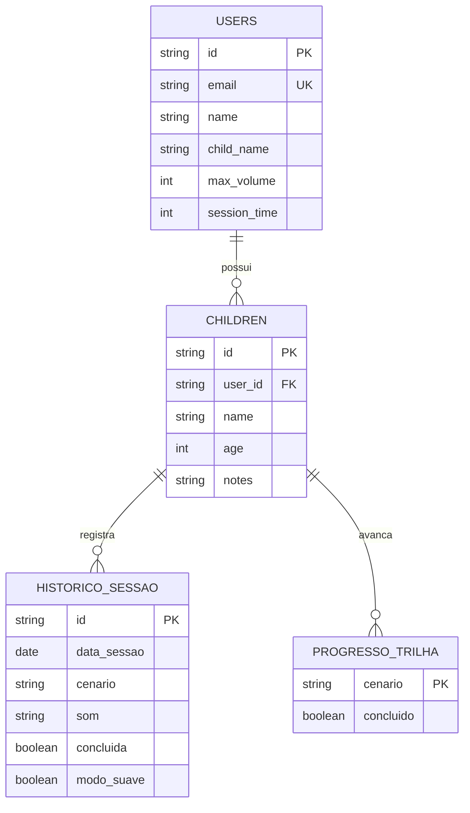

# Arquitetura

Este documento registra como o Ludo está organizado e por que cada escolha foi feita. A intenção é que qualquer pessoa que abra o repositório — inclusive a banca — consiga reconstruir o raciocínio sem precisar ler todo o código.

## Visão geral

O Ludo é um aplicativo React Native com Expo que funciona principalmente offline e usa um backend leve apenas para autenticar o responsável e guardar as configurações da criança. A divisão é intencional: a sessão de dessensibilização acontece em casa, muitas vezes sem conexão confiável, então nada essencial à reprodução dos sons pode depender da rede.

```
┌─────────────────────────────────────────────┐
│                Expo Router                  │
│   (child) trilha e player │ (parent) área   │
│                           │ do responsável  │
├─────────────────────────────────────────────┤
│         Contexts (Auth, Progress)           │
├──────────────────────┬──────────────────────┤
│  AsyncStorageHelper  │      api (axios)     │
│  progresso, sessões  │  token, perfil,      │
│  e sessão persistida │  configurações       │
├──────────────────────┼──────────────────────┤
│   Armazenamento do   │      PocketBase      │
│     dispositivo      │  users │ children    │
└──────────────────────┴──────────────────────┘
```

## Camadas

### Rotas (`app/`)

A navegação usa o roteamento por arquivos do Expo Router, com dois grupos que separam os perfis de uso:

- `(child)` — `journey.tsx` (trilha de cenários) e `exercise/[scenarioId].tsx` (player do cenário).
- `(parent)` — `login.tsx`, `register.tsx`, `settings.tsx`, `children.tsx` e `child-form.tsx`.

A separação em grupos não é só organizacional: ela cria a fronteira natural onde a proteção de acesso do responsável é aplicada, sem que a criança precise atravessar telas administrativas para chegar à trilha.

### Estado (`src/contexts/`)

O estado compartilhado fica em dois contextos, cada um com uma responsabilidade única:

- **`AuthContext`** — guarda o usuário e o token, restaura a sessão do armazenamento local na abertura do app e expõe `login` e `logout`. A resposta do PocketBase chega em `snake_case` e é convertida para o formato interno em `camelCase` por uma função de mapeamento, isolando o resto do app do formato do backend.
- **`ProgressContext`** — mantém os cenários concluídos e a utilização semanal, derivada do histórico local de sessões.

A escolha pela Context API, e não por uma biblioteca de estado global, é proporcional ao problema: são dois domínios de estado, com poucas atualizações e sem necessidade de seletores ou memoização fina. Adotar uma solução maior aqui traria configuração sem benefício.

### Persistência local (`src/helpers/AsyncStorageHelper.ts`)

O acesso ao Async Storage é centralizado em um helper tipado, com funções para texto, número, booleano e objeto. Isso evita `JSON.parse` espalhado pelas telas e concentra o tratamento de erro em um lugar só — leituras que falham devolvem `null` em vez de quebrar a interface, o que importa em um app que precisa abrir mesmo com o armazenamento inconsistente.

### Comunicação com o backend (`src/services/api.ts`)

Uma única instância do Axios concentra a comunicação com o PocketBase. A URL base vem de `EXPO_PUBLIC_API_URL`, nunca fixada no código, e um interceptador de requisição injeta o token de autenticação automaticamente. Assim nenhuma tela precisa lembrar de enviar credenciais, e trocar de ambiente (local, homologação) é questão de variável de ambiente.

### Catálogo de cenários (`src/data/scenarios.ts`)

Os cenários e seus sons são declarados como dados estáticos, com os arquivos de áudio resolvidos por `require` para entrarem no bundle do aplicativo. Cada som tem uma versão normal e uma suave, o que sustenta o modo suave sem lógica de processamento de áudio em tempo de execução. Manter isso como dado, e não espalhado em componentes, permite adicionar um cenário novo alterando um arquivo só.

## Modelo de dados

A persistência é híbrida, e a divisão segue o critério de quem precisa do dado e quando:

| Dado | Onde vive | Por quê |
|---|---|---|
| Credenciais e perfil do responsável | PocketBase (`users`) | Precisa de autenticação real e sobreviver à troca de aparelho |
| Cadastro da criança | PocketBase (`children`) | Vinculado à conta do responsável, com regra de acesso por dono |
| Token de sessão | Armazenamento do dispositivo | Evita novo login a cada abertura |
| Cenários concluídos | Armazenamento do dispositivo | Consultado a cada abertura da trilha, inclusive offline |
| Histórico de sessões | Armazenamento do dispositivo | Alimenta a utilização semanal sem depender de rede |



`USERS` e `CHILDREN` residem no PocketBase, criadas pelas migrações em `pb_migrations/`. `HISTORICO_SESSAO` e `PROGRESSO_TRILHA` hoje vivem no armazenamento local em formato de chave-valor e serão migradas para SQLite, quando o volume de registros passar a exigir consulta por período.

## Decisões de segurança

- **Regras de acesso por dono no PocketBase**: a coleção `children` só permite leitura e escrita ao usuário autenticado que a criou, impedindo que um token válido acesse dados de outra família.
- **Nenhum segredo no repositório**: a URL da API vem de variável de ambiente e o `.env` está fora do versionamento. O `.env.example` documenta as chaves esperadas sem expor valores.
- **Banco local fora do versionamento**: `pb_data/` e o executável do PocketBase são ignorados, para que dados de teste com e-mails reais não acabem no histórico do Git.
- **Teto de volume aplicado na reprodução**: o limite configurado pelo responsável restringe o próprio controle exibido à criança, em vez de apenas validar o valor no momento de salvar — a proteção precisa valer no ponto de uso, não só no cadastro.

### Limitações reconhecidas

- O token fica em armazenamento comum do dispositivo, sem criptografia. Para o escopo do trabalho é aceitável, mas o caminho natural é migrar para armazenamento seguro (Keychain/Keystore).
- Os formulários ainda validam entradas de forma pontual. A adoção do Zod, já planejada, dará um esquema único de validação para login, cadastro e configurações.

## Testes

Os testes usam Jest com o preset `jest-expo` e a Testing Library, concentrados nos componentes de interface com regra de negócio visível — o campo com rótulo, o nó da trilha e a visualização semanal. A prioridade foi cobrir o que o usuário enxerga e onde um erro passaria despercebido, em vez de perseguir cobertura numérica.

## O que ainda vai mudar

- Migração do progresso e do histórico para SQLite.
- Validação de formulários com Zod.
- Unificação da estilização com NativeWind.
- Substituição dos áudios reservados por sons reais, em versão normal e suave.
