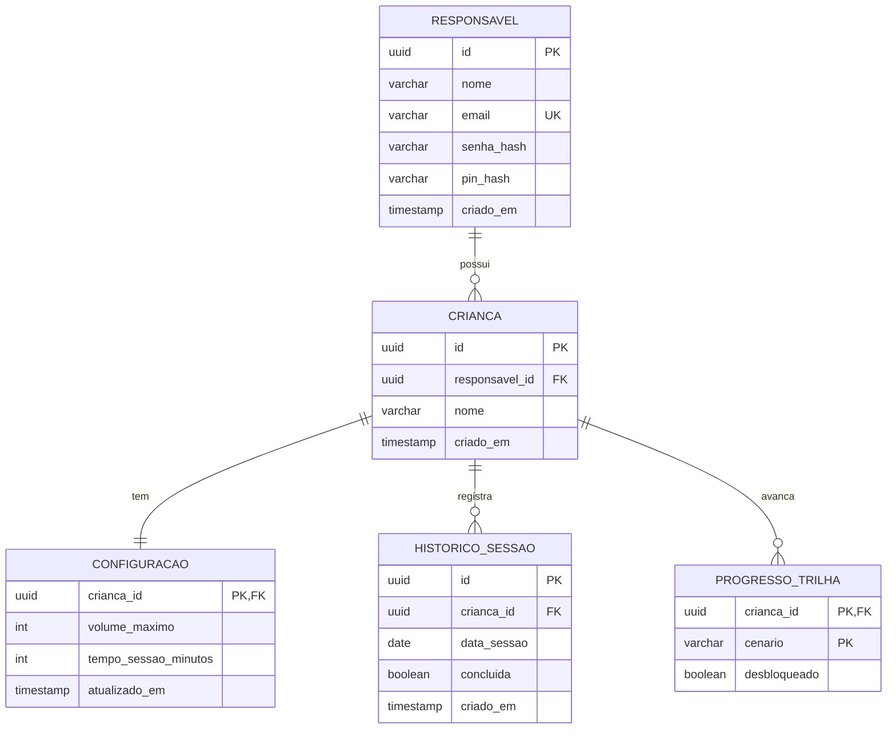

# Arquitetura

Este documento registra como o Ludo está organizado e por que cada escolha foi feita. A intenção é que qualquer pessoa que abra o repositório, inclusive a banca, consiga reconstruir o raciocínio sem precisar ler todo o código.

## Visão geral

O Ludo é composto por um aplicativo React Native com Expo e por uma API REST própria em Node.js com TypeScript, que persiste os dados em PostgreSQL. Essa é a arquitetura definida no capítulo 4.4 do projeto do TCC: a API autentica o responsável, guarda as configurações de cada criança e registra o histórico de sessões e o progresso na trilha, e toda a retaguarda roda em contêineres Docker. Os sons continuam embarcados no aplicativo, então a reprodução em si não depende de rede.

```
┌─────────────────────────────────────────────┐
│                Expo Router                  │
│   (child) trilha e player │ (parent) área   │
│                           │ do responsável  │
├─────────────────────────────────────────────┤
│         Contexts (Auth, Progress)           │
├──────────────────────┬──────────────────────┤
│  AsyncStorageHelper  │      api (axios)     │
│  token e progresso   │   token no cabeçalho │
└──────────────────────┴───────────┬──────────┘
                                   │ HTTP + JSON
┌──────────────────────────────────▼──────────┐
│        API REST (Node.js + Express)         │
│   rotas │ middlewares │ acesso ao banco     │
├─────────────────────────────────────────────┤
│                 PostgreSQL                  │
│  responsavel │ crianca │ configuracao       │
│  historico_sessao │ progresso_trilha        │
└─────────────────────────────────────────────┘
          orquestrados com Docker Compose
```

A primeira fase do desenvolvimento usou o PocketBase como backend provisório, para que a área do responsável pudesse ser construída antes da API. Ele ainda atende o aplicativo enquanto a API ganha as rotas de autenticação, crianças, configurações, histórico e progresso; a troca acontece em etapas, listadas ao final deste documento.

## Aplicativo

### Rotas (`app/`)

A navegação usa o roteamento por arquivos do Expo Router, com dois grupos que separam os perfis de uso:

- `(child)`: `journey.tsx` (trilha de cenários) e `exercise/[scenarioId].tsx` (player do cenário).
- `(parent)`: `login.tsx`, `register.tsx`, `settings.tsx`, `children.tsx` e `child-form.tsx`.

A separação em grupos não é só organizacional: ela cria a fronteira natural onde a proteção de acesso do responsável é aplicada, sem que a criança precise atravessar telas administrativas para chegar à trilha.

### Estado (`src/contexts/`)

O estado compartilhado fica em dois contextos, cada um com uma responsabilidade única:

- **`AuthContext`**: guarda o usuário e o token, restaura a sessão do armazenamento local na abertura do app e expõe `login` e `logout`. A resposta do backend chega em `snake_case` e é convertida para o formato interno em `camelCase` por uma função de mapeamento, isolando o resto do app do formato do servidor.
- **`ProgressContext`**: mantém os cenários concluídos e a utilização semanal, derivada do histórico de sessões.

A escolha pela Context API, e não por uma biblioteca de estado global, é proporcional ao problema: são dois domínios de estado, com poucas atualizações e sem necessidade de seletores ou memoização fina. Adotar uma solução maior aqui traria configuração sem benefício.

### Persistência local (`src/helpers/AsyncStorageHelper.ts`)

O acesso ao Async Storage é centralizado em um helper tipado, com funções para texto, número, booleano e objeto. Isso evita `JSON.parse` espalhado pelas telas e concentra o tratamento de erro em um lugar só. Leituras que falham devolvem `null` em vez de quebrar a interface, o que importa em um app que precisa abrir mesmo com o armazenamento inconsistente.

### Comunicação com o backend (`src/services/api.ts`)

Uma única instância do Axios concentra a comunicação com o servidor. A URL base vem de `EXPO_PUBLIC_API_URL`, nunca fixada no código, e um interceptador de requisição injeta o token de autenticação automaticamente. Assim nenhuma tela precisa lembrar de enviar credenciais, e apontar o app para a nova API é questão de trocar a variável de ambiente e os caminhos das rotas.

### Catálogo de cenários (`src/data/scenarios.ts`)

Os cenários e seus sons são declarados como dados estáticos, com os arquivos de áudio resolvidos por `require` para entrarem no bundle do aplicativo. Cada som tem uma versão normal e uma suave, o que sustenta o modo suave sem lógica de processamento de áudio em tempo de execução. Manter isso como dado, e não espalhado em componentes, permite adicionar um cenário novo alterando um arquivo só.

## Backend (`backend/`)

### API

A API usa Express com TypeScript. O ponto de entrada é a função `createApp(db)`, que monta a aplicação recebendo o acesso ao banco como parâmetro em vez de importá-lo diretamente. Com isso os testes sobem a API inteira com um banco simulado, sem precisar de PostgreSQL rodando, e o `server.ts` fica responsável apenas por ligar a aplicação ao banco real e abrir a porta.

O corpo das requisições é limitado a 10 KB, já que nenhuma rota do Ludo recebe arquivos, e o cabeçalho `X-Powered-By` é desligado para não anunciar a tecnologia do servidor. Erros passam por um tratador único que responde com mensagens genéricas: JSON malformado vira `400`, rota inexistente vira `404` e qualquer falha inesperada vira `500`, sem expor pilha de execução ou detalhes do banco para o cliente.

A rota `GET /health` executa uma consulta mínima no banco e responde `200` quando a conexão está de pé ou `503` quando não está. Ela serve para o Docker, para os testes e para quem estiver depurando a integração com o app.

O código segue três camadas por assunto: a rota recebe a requisição e valida o corpo, o serviço aplica a regra de negócio e o repositório é o único lugar que escreve SQL. Assim a regra de negócio não conhece HTTP nem SQL, e cada parte pode ser lida sozinha.

### Rotas

| Método e caminho | Acesso | O que faz |
|---|---|---|
| `GET /health` | livre | Informa se a API e o banco estão de pé |
| `POST /auth/cadastro` | livre | Cria a conta do responsável com nome, e-mail e senha |
| `POST /auth/login` | livre | Confere e-mail e senha e devolve o token de acesso |
| `GET /auth/perfil` | token | Devolve os dados do responsável dono do token |
| `POST /auth/pin` | token | Cria o PIN da área restrita, uma única vez |
| `POST /auth/pin/verificar` | token | Confere o PIN digitado para liberar a área restrita |
| `PUT /auth/pin` | token | Troca o PIN mediante a senha da conta ("Esqueceu o PIN?") |
| `GET /criancas` | token | Lista as crianças do responsável, cada uma com a sua configuração |
| `POST /criancas` | token | Cadastra uma criança, já com a configuração padrão |
| `GET /criancas/:id` | token | Devolve uma criança e a sua configuração |
| `PATCH /criancas/:id` | token | Altera o nome da criança |
| `DELETE /criancas/:id` | token | Remove a criança e tudo que pertence a ela |
| `PUT /criancas/:id/configuracao` | token | Define o volume máximo e o tempo de sessão |
| `PUT /criancas/:id/configuracao/padrao` | token | Volta a configuração para o padrão ("Retornar a configuração padrão") |

### Autenticação

O cadastro recebe nome, e-mail e senha, validados com Zod antes de qualquer acesso ao banco: o e-mail é normalizado (sem espaços e em minúsculas) e a senha precisa ter de 8 a 72 caracteres, o limite do bcrypt. A senha é guardada como hash bcrypt com custo 10. O e-mail repetido é detectado pela própria restrição `UNIQUE` do banco, e não por uma consulta anterior, para que dois cadastros simultâneos com o mesmo e-mail não passem os dois.

O login devolve um token JWT assinado com HS256, válido por 7 dias, que o aplicativo envia no cabeçalho `Authorization: Bearer`. Senha errada e e-mail inexistente recebem exatamente a mesma resposta, e o servidor faz a comparação do bcrypt mesmo quando o e-mail não existe, para que o tempo de resposta também não denuncie quais e-mails têm conta. Cadastro e login aceitam até 10 tentativas a cada 15 minutos por endereço de origem, o que inviabiliza testar senhas em massa.

No cadastro, a API responde `409` quando o e-mail já existe. Isso revela que aquele e-mail tem conta, mas a alternativa, fingir sucesso, só funciona com confirmação por e-mail, que está fora do escopo do MVP.

### PIN da área restrita

O PIN não faz parte do cadastro. Pelo fluxo do aplicativo, o responsável cria a conta, entra e só então define o PIN da área restrita, então `pin_hash` passou a aceitar valor nulo (migração `002`). As respostas da API trazem o campo `pinCadastrado`, que indica ao aplicativo quando levar o responsável para a tela de criação do PIN.

O PIN tem exatamente 4 números, como define o projeto, e é guardado em bcrypt como a senha. Ele é criado uma única vez pela rota `POST /auth/pin`; depois disso, a única forma de trocá-lo é pelo "Esqueceu o PIN?" da tela, que pede a senha da conta. Assim uma criança com o aparelho na mão não consegue redefinir o PIN, porque não sabe a senha.

O papel do PIN é o descrito no projeto: impedir o acesso acidental da criança às configurações. A proteção dos dados continua sendo o token de acesso, exigido em todas as rotas do responsável. Por isso a verificação do PIN não emite um segundo token: o aplicativo confere o PIN na API e libera a navegação para a área restrita.

Com só 10 mil combinações possíveis, o PIN depende de limite de tentativas. A verificação e a troca aceitam 5 erros a cada 15 minutos por responsável, contados pela conta e não pelo endereço de origem, e os acertos não entram na conta. PIN ou senha errados respondem `403`, diferente do `401` de token inválido, para o aplicativo saber quando mostrar "PIN incorreto" e quando mandar o responsável de volta para o login.

### Crianças e configuração

Toda consulta de criança filtra pelo responsável do token, inclusive nas atualizações e na exclusão. Uma criança de outra família responde `404`, exatamente como uma que não existe, para que a API não confirme a existência de dados alheios.

A criança e a configuração dela são criadas em um único comando SQL, então nunca existe criança sem configuração, e a resposta já traz as duas. Os valores padrão (teto de 50% do volume e sessão de 5 minutos) ficam no próprio banco, como `DEFAULT` das colunas: a criação usa esses valores e o "Retornar a configuração padrão" do protótipo volta a eles sem que o código precise repetir os números. O padrão começa pelo tempo mais curto e pela metade do volume porque a dessensibilização parte de estímulos baixos e curtos; o responsável ajusta a partir daí.

A criança tem apenas nome, como na Figura 1 do projeto. Idade e observações, que existiam no cadastro da fase com PocketBase, não fazem parte do modelo e saem do aplicativo quando a área do responsável passar a usar a API. O volume máximo é guardado de 1 a 100; a conversão para a escala de 0 a 1 do controle deslizante fica no aplicativo.

### Acesso ao banco

O acesso ao PostgreSQL é feito com o driver `pg`, sem ORM. O modelo de dados do projeto já está descrito em SQL, com tipos, chaves e restrições, e um ORM exigiria traduzi-lo para outra linguagem de esquema, em que restrições como `CHECK (tempo_sessao_minutos IN (5, 10))` não têm representação direta. Com SQL puro, a migração é o próprio modelo do documento. Todas as consultas usam parâmetros (`$1`, `$2`), nunca concatenação de texto, o que fecha a porta para injeção de SQL.

O pool de conexões escuta o próprio evento de erro. Sem isso, quando o banco reinicia e derruba uma conexão ociosa, o Node encerra o processo inteiro da API; com o tratamento, a API registra a perda, responde `503` enquanto o banco está fora e volta a funcionar sozinha quando ele retorna.

### Migrações

As migrações são arquivos `.sql` numerados em `backend/migrations/`, aplicados em ordem pelo comando `npm run migrate`. Cada arquivo roda dentro de uma transação e, quando termina, é registrado na tabela `migracoes`; se algo falhar no meio, nada daquele arquivo fica aplicado. Rodar o comando de novo só aplica o que ainda não foi aplicado, então ele é seguro para executar a cada inicialização do contêiner.

A escolha por um executor próprio, de poucas linhas, em vez de uma biblioteca de migrações, foi pela transparência: o mecanismo inteiro cabe em um arquivo que pode ser lido e explicado na defesa.

### Contêineres

O `docker-compose.yml` sobe dois serviços: o PostgreSQL 17 e a API. O banco tem verificação de saúde (`pg_isready`), e a API só inicia depois que ele está pronto para receber conexões. Ao subir, o contêiner da API aplica as migrações pendentes e então inicia o servidor. A imagem da API é construída em duas etapas: a primeira instala tudo e compila o TypeScript, a segunda leva apenas o JavaScript compilado e as dependências de produção, e roda com usuário sem privilégios.

## Modelo de dados

O modelo segue a modelagem relacional do capítulo 6.2 do projeto do TCC e está implementado em `backend/migrations/001_cria_tabelas_iniciais.sql`.



As regras de negócio que não podem depender só do aplicativo ficam no próprio banco:

| Regra | Como o banco garante |
|---|---|
| Tempo de sessão só pode ser 5 ou 10 minutos | `CHECK (tempo_sessao_minutos IN (5, 10))` |
| Teto de volume entre 1% e 100% | `CHECK (volume_maximo BETWEEN 1 AND 100)` |
| Um e-mail por responsável | `UNIQUE (email)` |
| Cada criança tem uma única configuração | `crianca_id` é a chave primária de `configuracao` |
| Configuração padrão de 50% e 5 minutos | `DEFAULT` nas colunas de `configuracao` |
| Um registro de progresso por cenário | chave primária composta `(crianca_id, cenario)` |
| Dados da criança somem junto com a conta | `ON DELETE CASCADE` em todas as chaves estrangeiras |

Senha e PIN são guardados apenas como hash; o texto original nunca chega ao banco. As consultas mais frequentes, crianças de um responsável e sessões de uma criança por período, têm índices próprios.

Em um ponto o banco diverge da Figura 1 do projeto: lá `pin_hash` é obrigatório, mas o PIN é criado depois do cadastro, no primeiro acesso à área restrita. A coluna passou a aceitar valor nulo, e o aplicativo vai pedir a criação do PIN antes de liberar a área restrita.

Enquanto a troca não termina, o aplicativo ainda usa as coleções `users` e `children` do PocketBase e guarda o histórico e o progresso no Async Storage. Essas informações passam para as tabelas acima conforme cada rota da API fica pronta.

## Decisões de segurança

- **Restrições no banco, não só na tela**: o teto de volume e o tempo de sessão são validados pelo PostgreSQL. Mesmo que uma requisição chegue à API com valores fora da regra, o banco recusa a gravação.
- **Teto de volume aplicado na reprodução**: o limite configurado pelo responsável restringe o próprio controle exibido à criança, em vez de apenas validar o valor no momento de salvar. A proteção precisa valer no ponto de uso, não só no cadastro.
- **Consultas parametrizadas**: nenhuma consulta monta SQL concatenando entrada do usuário.
- **Senhas com hash e login sem pistas**: senhas ficam em bcrypt, o login responde igual para senha errada e e-mail inexistente e as tentativas são limitadas por endereço de origem.
- **PIN protegido contra tentativa e erro**: o PIN fica em bcrypt, aceita 5 erros a cada 15 minutos por conta e só pode ser trocado com a senha.
- **Token com algoritmo fixo**: a verificação do JWT aceita apenas HS256, e o segredo de assinatura vem de variável de ambiente.
- **Erros sem detalhes internos**: a API nunca devolve pilha de execução, nome de tabela ou mensagem do banco para o cliente.
- **Nenhum segredo no repositório**: URLs, usuário e senha do banco vêm de variáveis de ambiente, e os arquivos `.env` estão fora do versionamento. Os `.env.example` documentam as chaves esperadas sem expor valores reais.
- **Dados locais fora do versionamento**: `pb_data/`, o executável do PocketBase e o volume do PostgreSQL ficam fora do Git, para que dados de teste com e-mails reais não acabem no histórico.

### Limitações reconhecidas

- O token fica em armazenamento comum do dispositivo, sem criptografia. Para o escopo do trabalho é aceitável, mas o caminho natural é migrar para armazenamento seguro (Keychain/Keystore).
- Os formulários do aplicativo ainda validam entradas de forma pontual. Na API, cada rota vai validar o corpo da requisição antes de chegar ao banco.
- Um PIN de 4 números em bcrypt pode ser descoberto por força bruta se alguém obtiver uma cópia do banco, já que são só 10 mil combinações. A proteção real do PIN é o limite de tentativas na API; o tamanho segue o projeto, que prioriza a facilidade de uso pelo responsável.
- O limite de tentativas fica na memória do processo da API e zera quando ela reinicia. Com uma única instância, como no MVP, isso é suficiente.

## Testes

No aplicativo, os testes usam Jest com o preset `jest-expo` e a Testing Library, concentrados nos componentes de interface com regra de negócio visível: o campo com rótulo, o nó da trilha e a visualização semanal. A prioridade foi cobrir o que o usuário enxerga e onde um erro passaria despercebido, em vez de perseguir cobertura numérica.

Na API, os testes usam o executor nativo do Node (`node:test`) com o Supertest, que faz requisições HTTP reais contra a aplicação montada em memória. Os testes de autenticação rodam contra um PostgreSQL de verdade, o PGlite, que roda dentro do próprio processo de teste: as migrações são aplicadas nele antes dos testes, então as restrições do banco também são testadas, sem precisar de Docker. Os dois projetos têm configurações separadas, e o Jest do aplicativo ignora a pasta `backend/`.

## O que ainda vai mudar

- Troca do PocketBase pela API no aplicativo, com as telas de criação e de digitação do PIN, o bloqueio da trilha antes do login e a remoção do backend provisório.
- Rotas de histórico de sessões e de progresso na trilha, alimentando a utilização semanal a partir do banco.
- Controle do tempo de sessão durante a reprodução, com aviso suave quando o tempo acaba.
- Sistema de recompensas visuais ao cumprir a meta da sessão.
- Suavização progressiva do volume no início de cada som.
- Substituição dos áudios reservados por sons reais, em versão normal e suave.
